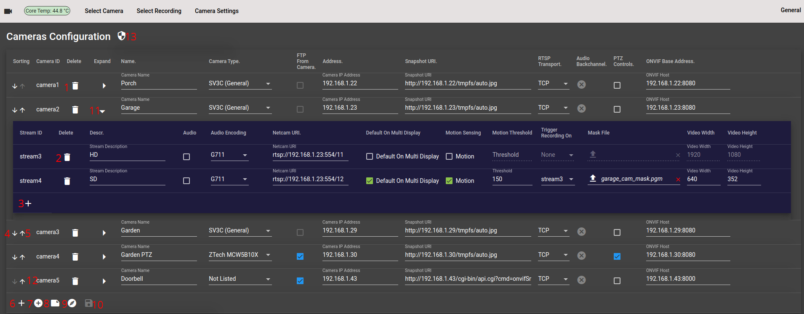

<h2 style="text-align: center">Security Cam, CCTV Via Web Browser</h2>

### Introduction
This is a Network Video Recorder accessed through a web browser, designed to run on a Raspberry pi.
Access can be either direct or through a Cloud service. There is no live implementation
of the Cloud Service, but the source code is freely available at
https://github.com/richard-austin/cloud-server.
It requires network cameras providing RTSP streams with the video encoded as H264 or H265. No
encoding of video streams is done as, running on a Raspberry pi, this
would be too CPU intensive. Audio streams in any format other than AAC are encoded to AAC.

### Run Time Platform for NVR
Raspberry pi running headless (server) version of Ubuntu 23.04 (Lunar Lobster).

### Security
The NVR is designed to run on a LAN which is protected from unauthorised
external access. From within the LAN, access to administrative functions is possible.
Secure authenticated access is obtained through ports 443 and 446 via nginx.
These ports, plus port 80,  are set up for port forwarding on the router when direct access is used.

When the NVR is accessed through the Cloud service, port forwarding is not required
as all communication is through a client connection that the NVR makes to the
Cloud service.
#### NVR features
* Secure authenticated web access.
* Live, low latency (approx 1 second) video from network cameras with RTSP source.
* Onvif device and capabilities discovery.
* View individual or all cameras on one page.
* Recordings of motion events, selectable by date and time.
* Recordings triggered by Motion service (https://github.com/Motion-Project/motion)
* Recordings triggered by FTP of an image from camera (can be used with cameras which can ftp an image on detecting motion).  
* Quick setup of certain camera parameters for SV3C type cameras.
* Hosting of camera admin page, This allows secure access to camera web admin outside the LAN.
This feature requires access through port 446 as well as the usual https port 443.
* Configuration editor supporting Onvif camera discovery.
* email notification if public IP address changes (when using port forwarding).
* Initial set up of user account from LAN only. Subsequent changes can be done when logged in through existing account.
* Get NVR LAN IP addresses.
* Get Local Wi-Fi details.
* Set/unset NVR Wi-Fi access.
* Enable/Disable access through Cloud server.
* All parts of project and dependencies deployed using deb file.

### Web Front End
The Web Front End (client) is an Angular application using [Angular CLI](https://github.com/angular/angular-cli) version 12.0.5 or later.
To get more help on the Angular CLI use `ng help` or go check out the [Angular CLI Overview and Command Reference](https://angular.io/cli) page.

### Web Back End
The Web Back End (server) is a Grails application, running on Tomcat 9, which provides
a Restful API for the Angular Web Front End.
It provides the calls to get and set application data as
well as configuring the Camera setup.

### Media Server
This provides a fragmented MP4 stream for each camera which forms the media source for
the Media Source Extensions video implementation used on the Web Front End.
ffmpeg connects to a camera RTSP output and converts that to fmp4 which can optionally include the audio stream.
ffmpeg feeds the input to the media server with an http stream while the media server supports web socket
connections through which the media streams are read. The media streams are
also available through http connections which are used when recordings are made. 

The Media Server is written in go (golang) and cross compiled for the ARM 64 architecture of the Raspberry pi.
### Wi-Fi Setup Service
This runs as a Linux service as root user. It is a web application written in Python,
used to list Wi-Fi access points, list the NVR's LAN IP addresses and set up the NVR Wi-Fi and credentials.
It also stops and starts the media server, recording service and the motion service
during and after configuration updates.

### Camera Recordings Service
This is an FTP server to which cameras can be set up to ftp an image file
when they detect motion. In response to receiving the image file, this
server starts recording from the appropriate (http output) stream on the
media server, making a recording of minimum length 30 seconds, but extended by a further 
30 seconds when another image file is FTP'd before a recording is completed.

Use of the Camera Recordings Service is configurable from the cameras configuration page and
is an alternative to the recording being triggered by the Motion service.
### Motion Service
Provides motion detection and recording. <a href="https://github.com/Motion-Project/motion">Motion</a> is a third party project. 
On this NVR, Motion can detect and record motion on one stream (usually the lower resolution stream to keep CPU usage down) and
trigger a recording on another (usually the higher resolution) stream so that recordings
in both resolutions are made. 

Configurable from the cameras configuration page.
### nginx
nginx is a reverse proxy which all client access to the NVR passes through.
#### nginx functions on the NVR
* TLS encryption of traffic.
* Translation from Tomcat port 8080 to HTTPS port 443.
* HTTP redirect from port 80.
* Webserver, live and recorded streams made available through a single port (443) at their designated URLs.
* Makes the unauthenticated live and recorded stream dependent on the web application authentication so that they 
cannot be accessed without the user having logged in.
## Development

#### Platform for Development
* Ubuntu 23.04 (Lunar Lobster) on PC

#### The following are what is used to build this project:-
* go version go1.20.1
* Angular CLI: 15.2.0 or greater
* Node: 18.17.1
* npm: 9.9.7
* Package Manager: npm 9.6.7
* Grails Version: 5.3.2
* JVM Version: 18.0.2-ea
* Gradle 7.4.2
* Python 3.11.4

### Set up build environment
* git clone git@github.com:richard-austin/security-cam.git
* cd security-cam
* gradle init

### If intending to access through the Cloud Server.
* If you intend to access the NVR via the Cloud Server (If not, ignore this)
  * In application.yml, ensure that environments -> production -> cloudProxy -> cloudHost
    is set to the correct IP for your Cloud server (cloudPort will normally be 8081)

### Build for deployment to Raspberry pi
* ./gradlew buildDebFile 

When the build completes navigate to where the .deb file was created:-

* cd xtrn-scripts-and-config/deb-file-creation
* scp the .deb file to the Raspberry pi

## Installation on the Raspberry pi
* sudo apt update
* sudo apt upgrade (restart if advised to after upgrade)
* Navigate to where the .deb file is located
* sudo apt install ./<i>deb_file_name</i>.deb 

* Wait for installation to complete.
* The Tomcat web server will take 1 - 2 minutes to start
  the application.
* <i>If this is the first installation on the Raspberry pi..</i>
  * Make a note of the product key (a few lines up). 
This will be required if you use the Cloud Service to connect
to the NVR.
  * <i>Generate the site certificate..</i>
    * cd /etc/security-cam
    * sudo ./install-cert.sh
    * Fill in the details it requests (don't put in any information you are not happy with being publicly visible, for 
example you may want to put in a fake email address etc.)

## Setup for Direct Access (Browser to NVR)
#### Set up user account
To log into the NVR when accessing it directly, 
a user account must be set up. This is done using the Create User Account
application (cua) which is accessible from the LAN without being 
logged in. Be sure port 8080 on the Raspberry pi is not 
accessible from outside the secure LAN. cua is also available when logged
into the NVT from "Admin Functions" on the General menu.
* From a separate device on the LAN, open a browser and go to
<a>http://<i>raspberry_pi_ip_addr</i>:8080/cua</a>
* Click on the hamburger icon at the top left of the page.
* Select "Create or Update User Account" from the menu.
* Enter the required user name.
* Enter the password, then again in Confirm Password
* Enter the email address you will use for forgotten password etc.
* Enter email again in Confirm email address.
* Click Update Account to confirm
## Setup SMTP email Client
The email address set up in the previous section is where warning emails 
are sent if the public IP address changes (when NVR is used on an
internet connection with dynamic IP), or for reset password links to
be sent when password is forgotten. To do this,
the NVR email client must be logged into an SMTP client
* Click on the hamburger icon at the top left of the page.
* Select Set Up "SMTP Client" from the menu.
* If the SMTP connection is to be authenticated (normally the case)...
  * Check the Authenticated checkbox.
  * Enter the SMTP password.
  * Enter the SMTP password again to confirm.
* If TLS encryption is to be used (normally the case)...
  * Check the TLS Encrypted checkbox.
  * Enter the host name for the SMTP client to trust 
(normally the SMTP host name).
* Enter the SMTP host name
* Enter the SMTP port
* Enter the "from" (sender) address these email will appear to come from
* Click confirm.

## Login to the NVR
* Set a browser to <a>https://<i>ip_addrs_of_raspberry_pi</i></a>
* Ignore the warning which may be given as a result of the homer generated
site certificate and continue to the log in dialogue box.
* Enter the username and password set up under "Set up user account". 
You can check "Remember me" to skip having to log in in future.

## Set up Wi-Fi (if required)
If you want to use Wi-Fi, and it hasn't previously been set up on the Raspberry pi, it can be done from the NVR. Note
that Wi-Fi settings can only be changed when the Raspberry pi is connected to the LAN and you are accessing the web server
through the Ethernet (eth0 on Raspberry pi) IP address.
* Connect a browser to the Raspberry pi's Ethernet LAN address.
* From the menu select General -> Wifi Admin -> Wifi Settings.
* Select your Wi-Fi access point on the dropdown
* Click connect.
* Enter the password if required.
* Click connect.
The Wi-Fi will now be set up, You can check the IP address for the Wi-Connection using the General -> 
Get Active Local IP Address(es) option.

## Set Up Cameras
The NVR must be configured to use your cameras.
The configuration editor can be found at General ->
Cameras Configuration.

*Cameras Configuration Editor button numbering*

#### Config page button functions

| Button  Number | Button                                                                                                                                   | Function                                                                                                                                                                                                                                                                                                                |
|--------------------|------------------------------------------------------------------------------------------------------------------------------------------|-------------------------------------------------------------------------------------------------------------------------------------------------------------------------------------------------------------------------------------------------------------------------------------------------------------------------|
| 1                  | </img>                           | Delete the corresponding camera and its streams. Disabled when there is only one camera                                                                                                                                                                                                                                 |
| 2                  | </img>                            | Delete the corresponding stream. Disabled when the stream is the only one on the camera.                                                                                                                                                                                                                                |
| 3                  | </img>                                     | Add a new stream. This will be unpopulated and all fields will need manual entry/setup.                                                                                                                                                                                                                                 |
| 4                  | </img>                           | Move the corresponding camera down one place in the list. The camera streams will be listed on the selection menus in the same order as they appear on this list.                                                                                                                                                       |
| 5                  | </img>                             | Move the corresponding camera up one place in the list. The camera streams will be listed on the selection menus in the same order as they appear on this list.                                                                                                                                                         |                                                                                                                                                                  |
| 6                  | </img>                                     | Add a new camera. This will add a camera with one stream, with all fields unpopulated. All fields will need to be populated manually.                                                                                                                                                                                   |
| 7                  | </img>                        | Add a new camera. You enter the Onvif URL for the required camera, and the camera details will be returned with camera specific data populated. Intended for when General Onvif Discovery has not picked up the camera or a new camera is added to an existing setup. This is the preferred way to add a single camera. |
| 8                  | </img> | Start a new configuration. After conformation, any camera data will be cleared and a single unpopulated camera/stream will be added.                                                                                                                                                                                    |
| 9                  | </img>                   | General Onvif discovery. After confirmation, the Onvif function will try to discover cameras on the network. Any that are found will have their characteristics populated.                                                                                                                                              |
| 10                 | </img>                                  | Save configuration. Any changes made with the editor will only become active after saving with this function.                                                                                                                                                                                                           |
| 11 *               | </img>                             | Show the cameras streams                                                                                                                                                                                                                                                                                                |
| 11 *               | </img>                            | Hide the cameras streams                                                                                                                                                                                                                                                                                                |
| 12                 | camera(<i>n</i>)                                                                                                                         | Camera ID. Click on this to show a snapshot from the camera. Note that this will require that the camera credentials are set up correctly (button 13 </img>)                                                         |
| 13                 | </img>                                | Set or change the user name and password used to access features on the cameras. Note that this currently requires all the cameras on the network to have the same credentials.                                                                                                                                         |

&ast; Button style toggles with context

### Onvif
With thanks to https://github.com/fpompermaier/onvif

The NVR supports Onvif camera discovery and population of parameters. This should be used
when supported by your cameras. Click on button 9 </img>
(Perform onvif LAN search for cameras) to locate cameras on the LAN. Before you can save
the configuration you need to complete any missing fields (typically
the camera names and stream descriptions). When done, click
on button 10 </img> to commit the current configuration

#### Camera not found
If any cameras do not respond to the multicast probe, they will not
be listed after Onvif discovery. Where Onvif is supported you can
search for individual cameras by their Onvif URL
Click button 7 , enter the Onvif URL (for example http://192.168.1.43:8080/onvif/device_service, where the IP
address is the IP of the camera). This will add the parameters
for the specified camera to the list. You then just need to complete the name and description fields.

Cameras can also be added manually by clicking on button 6 </img>
. In this case you will have to enter all parameters yourself, so it's
not recommended unless Onvif is not supported on the device.

#### Camera Parameters
| Parameter/Control  | Function                                                                                                                                                                                                                                                                                                                                                                       | Set by Onvif Discovery |
|--------------------|--------------------------------------------------------------------------------------------------------------------------------------------------------------------------------------------------------------------------------------------------------------------------------------------------------------------------------------------------------------------------------|------------------------|
| Sorting            | Up and down arrows move camera position in the list, and correspondingly on the menus.                                                                                                                                                                                                                                                                                         | N/A                    |
| Camera ID          | Map key of the camera. Clicking on this displays a snapshot from that camera.                                                                                                                                                                                                                                                                                                  | N/A                    |
| Delete             | Delete this camera and its streams from the configuration.                                                                                                                                                                                                                                                                                                                     | N/A                    |
| Expand             | Show/hide the cameras streams.                                                                                                                                                                                                                                                                                                                                                 | N/A                    |
| Name               | The name of the camera as it will appear on the menus.                                                                                                                                                                                                                                                                                                                         | No                     |
| Camera Type        | Select SV3C, ZTech MCW5B10X or Not Listed. The named options enable some admin functions under Camera Settings -> Quick camera Setup                                                                                                                                                                                                                                           | No                     |
| FTP From camera    | If checked, the camera ftp-ing an image to ./<i>camera_map_key</i> will trigger a recording. This is not available if Motion Sensing is set on any of the camera streams.                                                                                                                                                                                                      | No                     |
| Address            | Camera IP address                                                                                                                                                                                                                                                                                                                                                              | Yes                    |
| Snapshot URI       | The URL which returns a snapshot image from the camera.                                                                                                                                                                                                                                                                                                                        | Yes                    |
| RTSP Transport     | Determine whether to use TCP or UDP for the RTSP video/audio stream.                                                                                                                                                                                                                                                                                                           | No                     |
| Audio Backchannel  | Enable use of the cameras Audio backchannel for two way audio (if camera supports Onvif Profile T backchannel). ( inactive, </img> active. Click to toggle).</img> | Yes                    |
| PTZ Controls       | Enable PTZ cameras on the live stream view. This requires that the camera supports Onvif PTZ control.                                                                                                                                                                                                                                                                          | No                     |
| Onvif Base Address | IP address and port of the cameras Onvif SOAP web service.                                                                                                                                                                                                                                                                                                                     | Yes                    |

#### Stream Parameters
| Parameter/Control        | Function                                                                                                                                                                                                           | Set by Onvif Discovery |
|--------------------------|--------------------------------------------------------------------------------------------------------------------------------------------------------------------------------------------------------------------|------------------------|
| Stream ID                | Map key of the stream                                                                                                                                                                                              | N/A                    |
| Delete                   | Delete this stream from the camera.                                                                                                                                                                                | N/A                    |
| Descr.                   | Description of the stream (typically HD/SD). This is appended to the camera name on the menus.                                                                                                                     | No                     |
| Audio                    | Check to include the cameras audio with the video (if present).                                                                                                                                                    | No                     |
| Audio Encoding           | Set to the audio encoding on the cameras RTSP stream. If the audio format is AAC, it will be passed through as is, otherwise it will be encoded to AAC.                                                            | Yes                    |
| Netcam URI,              | The RTSP url used for the video/audio feed from the stream.                                                                                                                                                        | Yes                    |
| Default On Multi Display | Sets the stream for this camera which is shown by default on the Multi C amera View. Other camera streams can be selected from the Multi Camera View.                                                              | N/A                    |
| Motion Sensing           | If checked, the motion service will be used to detect motion from this stream. To keep CPU usage down, it's best to select a lower resolution stream. Not available if FTP is selected on the camera.              | N/A                    |
| Trigger Recording On     | When Motion Sensing is selected for the stream, you can select another (usually higher resolution) stream to record from in addition to this stream. Both streams will be selectable on the Select Recording menu. | N/A                    |
| Mask File                | Select a mask file for this stream in the motion service. (see https://motion-project.github.io/motion_config.html#mask_file).                                                                                     | N/A                    |
| Video Width              | For motion Service, the width of the video stream in pixels (see https://motion-project.github.io/motion_config.html#width)                                                                                        | Yes                    |
| Video Height             | For Motion Service, the height of the video stream in pixels (see https://motion-project.github.io/motion_config.html#height)                                                                                      | Yes                    |

## Using the NVR

### The Menus 

The NVR has a menu bar at the top of the page. On a PC screen
this menu bar will normally show the menu names, though on a mobile
device a hamburger icon must be tapped to reveal them.

If no function is selected, the
page below will be blank.

#### Select Camera
This menu allows selection of live video/audio camera streams. The names
are listed in the form <i>Camera Name(Stream Description)</i>
so there can be more than one stream per camera

<i>Multi Camera View</i>

The last option on the Select Camera menu is Multi Camera View. This shows one stream
from each camera in the configuration. The default stream shown
for a camera will be the one selected as Default On Multi Display.
Camera streams can be switched from the menu shown when you click the
</img>
button at the top left of the page.
#### Select Recording
This menu allows selection of recordings made on camera streams.
The names
are listed in the form <i>Camera Name(Stream Description)</i>
On selection, the latest recording on that stream will be shown. 
Earlier recordings can be selected from the date control and Motion
Events selector in the top left of the page.

#### Camera Settings
* **Quick Camera Setup**

  <i>Quick Camera Setup is available only for SV3C and ZXTech cameras (as set in the 
configuration for Camera Type)</i>

  This provides a convenient means of setting the night lighting mode, and Camera Name.
  The camera can also be rebooted if required.
* **Camera Admin** 

  Note that for this function to be accessible outside the LAN, port forwarding must be set up for port 446.

  Provides access to camera web admin page through the NVR. Access is 
protected by the NVR authentication system (Spring Security) as well as the cameras own authentication. SV3C 
and ZXTech camera credentials are provided by the NVR if they
were set up in the camera configuration page, otherwise they will need to be entered after selecting the camera.
Any other camera types will need their credentials entered after the camera is selected.

#### General
* **Configure Camera Setup**

  Set up the NVR for your camera set (which must be on the same LAN as the NVR).

  This is described in more detail under the section "Set Up Cameras" above.
* **Log Off**

  Log off from the NVR, a dialogue box allows confirmation or cancel of this operation.
* **Change Password**

  User must first enter the current password, then enter and confirm a new one.
* **Change Account Email**

  The email address is where password reset links will be sent when requesting from the login page. It is also where warnings messages are sent if the public IP address has changed (when used with port forwarding).

  User must first enter the password, then enter and confirm the new email address.
* **Set Up Guest Account**

  The guest account allows viewing the live streams and recordings, but does not allow any sort of admin access which could alter the configuration.

  Enter and confirm a password for the guest account. This password
is used with the username "guest" to log in. The checkbox allows the guest account to be enabled and disabled, while the password remains unaltered.
 
* **Save current IP**
  
  Save the current public IP that the NVR appears at (with port forwarding set up).

  If the public IP subsequently changes from this, a warning email will be sent to the registered 
email address, giving the new public IP address.

  This function is only used after setting up a new NVR or after the public IP has changed.
* **Get Active Local IP Addresses**

  Get the LAN addresses of the NVR. There are IP addresses for the Wi-Fi and Ethernet interfaces.
* **Wifi Admin**
  * **Local Wifi Details**

    Lists the Wi-Fi access points in the area along with signal strength and other information.
  * **Wifi Settings**

    Setup or enable/disable the NVR Wi-Fi connection.

    To use this the NVR must have an Ethernet connection, and the browser must be connected to the NVR through the Ethernet IP address. 
* **Set CloudProxy Status**

  Checkbox is checked to enable the Cloud Proxy, otherwise the Cloud Proxy will not connect to the Cloud Service.
  The Cloud Proxy is used to provide a connection to the Cloud Service from the NVR.
This is a client connection and so doesn't require port forwarding to be set up. Most functions 
of the NVR will be available via the Cloud Service. The Camera Admin page functionality is not available via the Cloud Service.
This defaults to "on" when the local NVR account is not set up.

  The NVR must have the correct cloudHost/cloudPort set up in application.yml if the Cloud Service is used.
* **Admin Functions**
  
  The initial setup functions used to set credentials for a direct access account.
This can be accessed on the LAN without authentication at http://nvr_lan_ip_addr:8080/cua/.

  Click on the hamburger icon at the top left for the menu options·
  * **Create or Update User Account**

    When accessed via the General -> Admin Functions menu, a user account will already exist. 
    In this case you can use this to modify the username and/or password and/or email address for the account.
In any case, all those fields must be entered before clicking Update Account.
  * **Set Up SMTP Client**

    The SMTP Client must be set up for the NVR to send emails (reset password and changed public IP notification).

    Use this if you need to set up or change the settings for the NVR's SMTP client.
    All fields must be entered before clicking Confirm. Any existing values will be
    shown in their fields.
* **About**

  version information for the NVR.
