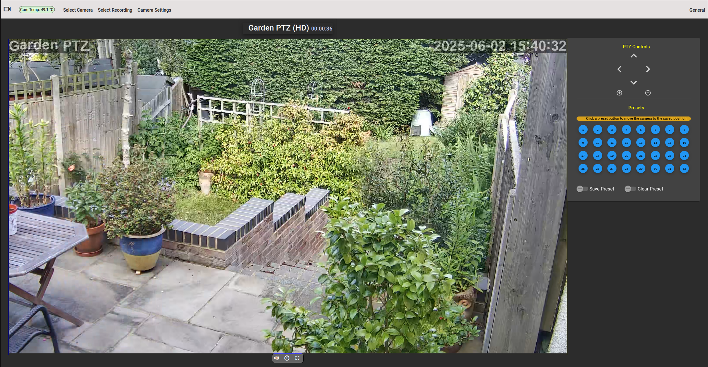

<h2 style="text-align: center">Security Cam</h2>
<h2 id="h2" style="text-align: center">CCTV on Raspberry Pi 4 Via Web Browser</h2>

### Introduction
This is a Network Video Recorder accessed through a web browser making it accessible from anywhere on PC or smart phone. 
Designed to run on a Raspberry pi, it has low power consumption and runs reliably 24/7.
It requires network cameras providing RTSP streams with the video encoded as H264 or H265. Audio (G711 or AAC) is supported. 
The audio and video is remultiplexed to fragmented MP4 (fMP4) for rendering on the browser using Media Source Extensions (MSE).


*PTZ camera as viewed with Google Chrome*


*Multi camera view on Google Chrome (edited for privacy)*

#### NVR features
* Complete system deployment using a single deb file, which is available pre-built for Raspberry pi 4 or 5 in the <a href="https://github.com/richard-austin/security-cam/releases">Releases</a> section.
* Secure authenticated web access.
* Low latency (approx 1 second or less) live video and audio.
* Supports network cameras with RTSP streams H264/H265/audio (not USB cameras).
* Onvif support for device and capabilities discovery and PTZ control.
* View live stream from individual or all cameras.
* Recordings triggered by <a href="https://github.com/Motion-Project/motion">Motion service</a>
*OR* by FTP of an image from camera (can be used with cameras which can ftp an image on detecting motion). 
* Recordings of motion events, selectable by date and time.
* PTZ for cameras supporting this feature through Onvif.
* Quick reboot or setup of key camera parameters for SV3C or ZXTech type cameras.
* Hosting of camera admin page, This allows secure access to camera web admin outside the LAN.
  This feature requires access through port 446 as well as the usual https port 443.
* Configuration editor supporting Onvif discovery of cameras and their capabilities. Can also find capabilities of specific cameras.
* email notification if public IP address changes (for when port forwarding is used).
* Initial unauthenticated set up of user account from LAN only. Subsequent changes can be done when logged in through existing account.
* Get NVR LAN IP addresses.
* Get Local Wi-Fi source details.
* Set up Wi-Fi connection.
* NVR includes NTP server for cameras to sync time without the need for them to connect to the internet.

#### Limitations
* The .deb file produced with ./gradlew buildDebFile is set up to install on a Raspberry pi running Ubuntu 24.04 (Noble Numbat). 
Availability of dependencies may prevent installation on other Ubuntu versions.
* Requires network cameras which provide H264 or H265 (HEVC) video, and optionally audio via RTSP (G711/AAC). *No video transcoding
is done on the raspberry pi to keep CPU utilisation low*
* The browser used must be able to display the video format used. Most browsers will support H264, but on some
older machines, the GPU may not support H265 (HEVC) decoding. There are special chromium forks which can render H265
with software decoding (see <a href="https://thorium.rocks/">Thorium</a> and <a href="https://github.com/StaZhu/enable-chromium-hevc-hardware-decoding">Special Chromium Build</a>)
  * For Chromium based browsers running on Ubuntu 23.04 with VAAPI installed and a suitable Intel GPU, you may need to use the parameters 
  ```--enable-features=VaapiVideoDecodeLinuxGL,VaapiVideoDecoder,VaapiVideoEncoder``` 
   in the command line to enable hevc decoding.
This will also enable hardware decoding generally.
* Web admin hosting where the camera uses https and rstps (secure rtsp streaming from cameras) are not currently supported.
* This software has been tested with SV3C and ZXTech cameras and Reolink Wi-Fi doorbell.
There could possibly be compatibility issues with some other camera types.
* 2 way audio (Onvif profile T) supported on the Reolink Wi-fi doorbell using firmware version v3.0.0.1996_23053101.
The firmware from Reolink main downloads site does not fully support this functionality. 

## Installation
* Set up Ubuntu 24.04 Server (Noble Numbat) on a Raspberry pi 4 or 5
* ```bash
    sudo apt update
    sudo apt upgrade
    ```
* Using the deb file in the [release](https://github.com/richard-austin/security-cam/releases/tag/9.0.0) section or one you have build yourself
(see [DEVELOPMENT.md](DEVELOPMENT.md)) , Copy the deb file to the Raspberry pi.
* ssh to the Raspberry pi.
* ```bash
  # Install with
  sudo apt install ./security-cam_9.0.0_arm64.deb
  ```
* See [SETTING-UP.md](SETTING-UP.md) for how to set up user account, wifi, cameras etc.

## Documentation 
You can find further documentation in these files: -
* [STRUCTURE.md](STRUCTURE.md)
* [DEVELOPMENT.md](DEVELOPMENT.md)
* [FFMPEG.md](FFMPEG.md)
* [SETTING-UP.md](SETTING-UP.md)
* [USING-THE-NVR.md](USING-THE-NVR.md)
* [README_CLOUD.md](README_CLOUD.md)
