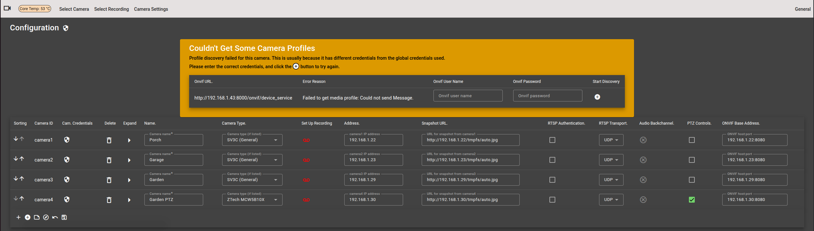
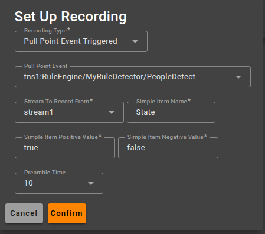

## Initial Setup (after installation)
### Setup for Direct Access (Browser to NVR)
#### Set up user account
To log into the NVR when accessing it directly,
a user account must be set up. This is done using the Create User Account
application (cua) which is accessible from the LAN without authentication. ***Be sure port 8080 on the Raspberry pi is not
accessible from outside the secure LAN***. cua is also available when logged
into the NVR (from "Admin Functions" on the General menu).
* From a separate device on the LAN, open a browser and go to
  <a>http://*nvr_ip_addr*:8080/cua</a> (where *nvr_ip_addr* is the LAN ip address of the NVR)
* Click on the </img> icon at the top left of the page.
* Select "Create or Update User Account" from the menu.
* Enter the required username.
* Enter the password, then again in Confirm Password
* Enter the email address you will use for forgotten password etc.
* Enter email again in Confirm email address.
* Click Update Account to confirm
#### Setup SMTP email Client
The email address set up in the previous section is where warning emails
are sent if the public IP address changes (when NVR is used on an
internet connection with dynamic IP), or for reset password links to
be sent when password is forgotten. To do this,
the NVR email client must be logged into an SMTP client
* Click on the </img> icon at the top left of the page.
* Select Set Up "SMTP Client" from the menu.
* If the SMTP connection is to be authenticated (normally the case)...
    * Check the Authenticated checkbox.
    * Enter the SMTP password.
    * Enter the SMTP password again to confirm.
* If TLS encryption is to be used (normally the case)...
    * Check the TLS Encrypted checkbox.
    * Enter the host name for the SMTP client to trust
      (normally the SMTP host name).
* Enter the SMTP host name
* Enter the SMTP port
* Enter the "from" (sender) address these email will appear to come from
* Click confirm.

## Login to the NVR
* Set a browser to <a>https://<i>nvr_ip_addr</i></a>
* Ignore the warning which may be given as a result of the home generated
  site certificate and continue to the log in dialogue box.
* Enter the username and password you set up when creating the account.
  You can check "Remember me" to enable auto login in the future.
* Click the SIGN-IN button
* You are now logged into your NVR and should see a menu bar at the top of a blank page.
## Set up Wi-Fi (if required)
If you want to use Wi-Fi, and it hasn't previously been set up on the Raspberry pi, it can be done from the NVRs
Wifi Admin -> Wifi Settings page. Note
that Wi-Fi settings can only be changed when the Raspberry pi (NVR) is connected to the LAN and you are accessing the web server
through the Ethernet (eth0 on Raspberry pi) IP address.
* Connect a browser to the NVRs Ethernet LAN address.
* From the menu select General -> Wifi Admin -> Wifi Settings.
* Select your Wi-Fi access point on the dropdown
* Click connect.
* Enter the password if required.
* Click connect.

The Wi-Fi will now be set up, You can check the IP address for the Wi-Fi Connection using the General ->
Get Active Local IP Address(es) option.

## Set Up Cameras
The NVR must be configured to use your cameras.
The configuration editor can be found at General ->
Cameras Configuration.

If camera configuration has not yet been done, the Cameras Configuration Editor will
be empty apart from a single unpopulated camera entry.

*Cameras Configuration Editor*

#### Config page button functions
</img> **(At top of page to the left of the
page title).**

Set the global Onvif credentials used during single and all camera Onvif discovery. Cameras successfully discovered
will have their credentials set to those entered here. Cameras whose credentials were different from these, will
be listed [above the table](#wrong-onvif-creds)
allowing the correct credentials to be entered against them before
retrying discovery on them individually.
### Onvif
From https://github.com/fpompermaier/onvif

The NVR supports Onvif camera discovery and population of parameters. This should be used
when supported by your cameras. Click on the </img> button
(Perform onvif LAN search for cameras) to locate cameras on the LAN. Before you can save
the configuration you need to complete any missing fields (typically
the camera names and stream descriptions). When done, click
on the </img> button to commit the current configuration

#### Camera not found
If any cameras do not respond to the multicast probe, they will not
be listed after Onvif discovery. Where the camera supports Onvif, you can
search for individual cameras by their Onvif URL
Click the  button, enter the Onvif URL (for example http://192.168.1.43:8080/onvif/device_service, where the IP
address is the IP of the camera). This will add the parameters
for the specified camera to the list. You then just need to complete the name and description fields and recording settings etc.

Cameras can also be added manually by clicking on the </img> button
. In this case you will have to enter all parameters yourself, so it's
not recommended unless Onvif is not supported on the device.

#### Button Functions
The buttons on the editable table for NVR camera configuration are
described below: -

| Button                                                                                                                                   | Function                                                                                                                                                                                                                                                                                                                                                                                    |
|------------------------------------------------------------------------------------------------------------------------------------------|---------------------------------------------------------------------------------------------------------------------------------------------------------------------------------------------------------------------------------------------------------------------------------------------------------------------------------------------------------------------------------------------|
| </img> (on&nbsp;camera&nbsp;row) | Delete the corresponding camera and its streams. Disabled when there is only one camera                                                                                                                                                                                                                                                                                                     |
| </img> (on&nbsp;stream&nbsp;row)  | Delete the corresponding stream. Disabled when the stream is the only one on the camera.                                                                                                                                                                                                                                                                                                    |
| </img>                                     | Add a new stream. The new stream will be unpopulated and all fields will need manual entry/setup.                                                                                                                                                                                                                                                                                           |
| </img>                                             | Move the corresponding camera down one place in the list. The cameras will be listed on the selection menus in the same order as they appear on this list.                                                                                                                                                                                                                                  |
| </img>                             | Move the corresponding camera up one place in the list. The cameras will be listed on the selection menus in the same order as they appear on this list.                                                                                                                                                                                                                                    |                                                                                                                                                                  |
| </img>                                     | Add a new camera. This will add a camera with one stream, with all fields unpopulated. All fields will need to be populated manually.                                                                                                                                                                                                                                                       |
| </img>                        | Add a new camera. You enter the Onvif URL for the required camera, and the camera details will be returned with camera specific data populated. Intended for when General Onvif Discovery has not picked up the camera or a new camera is added to an existing setup. This is the preferred way to add a single camera. You will need to enter the camera name and stream ID's as a minimum |
| </img> | Start a new configuration. After confirmation, any camera data will be cleared and a single unpopulated camera/stream will be added. You will need to populate all the camera and stream fields, manually.                                                                                                                                                                                  |
| </img>                   | General Onvif discovery. After confirmation, the Onvif function will try to discover cameras on the network. Any that are found will have most of their characteristics populated.                                                                                                                                                                                                          |
| </img>                                  | Save configuration. Any changes made with the editor will only become active after saving with this function. Make sure to use this after making any updates.                                                                                                                                                                                                                               |
| </img>  &ast;                      | Show the cameras streams                                                                                                                                                                                                                                                                                                                                                                    |
| </img> &ast;                      | Hide the cameras streams                                                                                                                                                                                                                                                                                                                                                                    |
| camera(<i>n</i>)                                                                                                                         | Camera ID. Click on this to show a snapshot from the camera. Note that this will require that the camera credentials are set up correctly (</img> button)                                                                                                                                |
| </img>                                | Enter or change credentials for this camera. These credentials will be used on view snapshot (on config setup), on camera settings and admin page hosting (SV3C and ZXTech cameras only) and in RTSP authentication (when selected).                                                                                                                                                        |
| </img>                           | Open [recording setup](#recording-setup) dialogue box. From this, one of three recording triggers can be set, or no recording if required.                                                                                                                                                                                                                                                  |

&ast; Button style toggles with context

#### Camera Configuration Parameters
All these parameters can be set manually, though some are auto-populated by Onvif discovery.

| Parameter/Control   | Function                                                                                                                                                                                                                                                                                                                                                                                                                                                                                                                                     | Set by Onvif Discovery |
|---------------------|----------------------------------------------------------------------------------------------------------------------------------------------------------------------------------------------------------------------------------------------------------------------------------------------------------------------------------------------------------------------------------------------------------------------------------------------------------------------------------------------------------------------------------------------|------------------------|
| Sorting             | Up and down arrows move camera position in the list, and correspondingly on the menus.                                                                                                                                                                                                                                                                                                                                                                                                                                                       | N/A                    |
| Camera ID           | Map key of the camera. Clicking on this displays a snapshot from that camera.                                                                                                                                                                                                                                                                                                                                                                                                                                                                | N/A                    |
| Cam Credentials     | Enter or change the credentials used for this camera. This is set to the global onvif credentials if this camera was successfully discovered with Onvif, but can be changed with this function if required.    NOTE: You must save save the configuration (using the </img> button) to make the credentials stick.  Before saving, you can click on the camera ID to check the (usually authenticated) snapshot is working. | N/A                    |
| Delete              | Delete this camera and its streams from the configuration (trash button).                                                                                                                                                                                                                                                                                                                                                                                                                                                                    | N/A                    |
| Name                | The name of the camera as it will appear on the menus.                                                                                                                                                                                                                                                                                                                                                                                                                                                                                       | No                     |
| Camera Type         | Select SV3C, ZTech MCW5B10X or Not Listed. The named options enable some admin functions under Camera Settings -> Quick camera Setup                                                                                                                                                                                                                                                                                                                                                                                                         | No                     |
| Address             | Camera IP address                                                                                                                                                                                                                                                                                                                                                                                                                                                                                                                            | Yes                    |
| Snapshot URI        | The cameras snapshot URL.                                                                                                                                                                                                                                                                                                                                                                                                                                                                                                                    | Yes                    |
| RTSP Authentication | If checked, authentication will be used on the RTSP connection to the camera. The credentials will be those entered for the camera set on the Cameras Config page.                                                                                                                                                                                                                                                                                                                                                                           | No                     |
| RTSP Transport      | Determine whether to use TCP or UDP for the RTSP video/audio stream. If in doubt, use TCP.                                                                                                                                                                                                                                                                                                                                                                                                                                                   | No                     |
| Audio Backchannel   | Enable use of the cameras Audio backchannel for two way audio (if camera supports Onvif Profile T backchannel). ( inactive, </img> active. Click to toggle).</img>                                                                                                                                                               | Yes                    |
| PTZ Controls        | Enable PTZ controls on the live stream view. This requires that the camera supports Onvif PTZ control.                                                                                                                                                                                                                                                                                                                                                                                                                                       | No                     |
| Onvif Base Address  | IP address and port of the camera Onvif SOAP web service.                                                                                                                                                                                                                                                                                                                                                                                                                                                                                    | Yes                    |

#### Stream Parameters
| Parameter/Control        | Function                                                                                                                                                                                                                                                                                                                                                                                                                       | Set by Onvif Discovery |
|--------------------------|--------------------------------------------------------------------------------------------------------------------------------------------------------------------------------------------------------------------------------------------------------------------------------------------------------------------------------------------------------------------------------------------------------------------------------|------------------------|
| Stream ID                | Map key of the stream                                                                                                                                                                                                                                                                                                                                                                                                          | N/A                    |
| Delete                   | Delete this stream from the camera.                                                                                                                                                                                                                                                                                                                                                                                            | N/A                    |
| Descr.                   | Description of the stream (typically HD/SD). This is appended to the camera name on the menus.                                                                                                                                                                                                                                                                                                                                 | No                     |
| Audio                    | Check to include the cameras audio with the video (if present).                                                                                                                                                                                                                                                                                                                                                                | No                     |
| Audio Encoding           | Set to the audio encoding on the cameras RTSP stream. If the audio format is AAC, it will be passed through as is, otherwise it will be encoded to AAC.                                                                                                                                                                                                                                                                        | Yes                    |
| Netcam URI               | The cameras RTSP video/audio url.                                                                                                                                                                                                                                                                                                                                                                                              | Yes                    |
| Default On Multi Display | Sets the stream as this cameras default on the Multi Camera View. The multi camera view allows switching to other streams than the default.                                                                                                                                                                                                                                                                                    | N/A                    |

 
*Camera Configuration Editor Showing A Camera Whose Onvif Credentials Differ From The Global Onvif Credentials*
## One or More Cameras Failing Onvif Authentication During Discovery
### Cameras in this category will be listed in the orange bordered box shown in the above screenshot.
Enter the correct Onvif user name and password for the camera listed in the orange bordered box and click the </img>
button beside the password to run single camera discovery using these credentials. If successful, the camera will be removed from this list and added
tol the cameras list below, where parameter entry can be completed. Once all parameters are set, the new configuration must be saved
(</img> button) to take effect.

## Set Up Recording
Setting up recordings is done using the Set Up Recording dialogue which is shown on clicking on the
</img> button on the related camera row.

### Motion Service Triggered Recordings
The motion service is included in the Security Cam installation and is used to detect motion events
on one of the camera streams (usually a lower res stream to keep CPU usage lower) 
and record that motion event from that stream. 
Additionally, this event can trigger a recording on a second stream on the camera (normally the HD stream)
so recordings in two different video resolutions are possible. : -

#### On the Recording Type selector, select "Motion Service" 

| Parameter/Control            | What To Set It To                                                                                                                                                                                                                                                                                                                                                                                                                                         | Set By Onvif |
|------------------------------|-----------------------------------------------------------------------------------------------------------------------------------------------------------------------------------------------------------------------------------------------------------------------------------------------------------------------------------------------------------------------------------------------------------------------------------------------------------|--------------|
| Stream To Monitor For Motion | Select the stream (stream1, stream2 ..) which will be monitored for motion. (To keep CPU usage as low as possible, this should be the lower resolution stream).                                                                                                                                                                                                                                                                                           | N/A          |
| Motion Threshold             | This adjusts the motion sensing sensitivity. See Motion project documentation <a href="https://motion-project.github.io/motion_config.html#threshold">here</a>                                                                                                                                                                                                                                                                                            | N/A          |
| Trigger Recording On         | Select a second stream to record from when motion is sensed on the first stream. This will normally be the higher resolution stream. Both resolutions will be selectable from the Select Recording menu.                                                                                                                                                                                                                                                  | N/A          |
| Preamble Frames              | This does not affect the recording made by motion service, it affects only the stream selected for "Trigger Recording On" above. This is the number of frames to delay the stream by when making the recording. The recording will then contain a period of activity before the point at which it was triggered. Note that frames also include audio frames, so the if the stream includes audio, this may need to be a higher number for the same delay. | N/A          |
| Mask File                    | Select a mask file for this stream in the motion service. (see https://motion-project.github.io/motion_config.html#mask_file).                                                                                                                                                                                                                                                                                                                            | N/A          |
| Video Width                  | For motion Service, the width of the video stream in pixels (see https://motion-project.github.io/motion_config.html#width)                                                                                                                                                                                                                                                                                                                               | Yes          |
| Video Height                 | For Motion Service, the height of the video stream in pixels (see https://motion-project.github.io/motion_config.html#height)                                                                                                                                                                                                                                                                                                                             | Yes          |

### FTP Triggered Recordings
FTP triggered recordings are started when the camera sends a .jpg image to the 
NVR to the appropriate folder (the folder name must be the camera ID, e.g. camera1 ..n as appropriate.).
This is useful when the camera has more sophisticated motion detection than that
provided by the motion service (people detection etc.), and it is able to FTP a still image
on motion detection. The NVR must be set up to accommodate this.

#### On the Recording Type selector, select "FTP Triggered" 

| Parameter/Control     | Function                                                                                                                                                                                                                                                                                                                 | Set by Onvif Discovery |
|-----------------------|--------------------------------------------------------------------------------------------------------------------------------------------------------------------------------------------------------------------------------------------------------------------------------------------------------------------------|------------------------|
| Stream To Record From | Recording will be made from the selected stream when the camera sends a .jpg (jpeg) to ./<i>camera_map_key</i>  on the NVR IP address on port 2121.                                                                                                                                                                      | N/A                    |
| Preamble Frames       | This is the number of frames to delay the stream by when making the recording. The recording will then contain a period of activity before the point at which it was triggered. Note that frames also include audio frames, so the if the stream includes audio, this may need to be a higher number for the same delay. | N/A                    |
| Retrigger Window      | The time window in seconds during which the recording can be extended (by retrigger window seconds) by further FTP uploads from the camera.                                                                                                                                                                              | N/A                    |

### Pull Point Event Triggered Recordings
This option is only available for cameras which support pull point subscription
(Onvif profile T). This has the advantage over FTP triggered recordings in that
no setting up on the camera itself is required, and also there may be several topics
to choose from when selecting the recording trigger.

#### On the Recording Type selector, select "Pull Point Event Triggered"

| Parameter/Control     | Function                                                                                                                                                                                                                                                                                                                                              | Set by Onvif Discovery                                                        |
|-----------------------|-------------------------------------------------------------------------------------------------------------------------------------------------------------------------------------------------------------------------------------------------------------------------------------------------------------------------------------------------------|-------------------------------------------------------------------------------|
| Pull point event      | Select the topic that you want to trigger recording with. Some topics may not be sent on motion detection, for example on a Reolink Video Doorbell, there is a Visitor topic which is fired when the doorbell is pressed                                                                                                                              | No, though the topic list in the selector is populated during Onvif discovery | 
| Stream To Record From | Recording will be made from the selected stream when the camera sends the selected topic with value true. The recording normally finishes 1 minute after the topic is received with value false. If the topic is received with value true before this 1 minute is up, the timout will start again after the topic is received with value false again. | N/A                                                                           |
| Preamble Frames       | This is the number of frames to delay the stream by when making the recording. The recording will then contain a period of activity before the point at which it was triggered. Note that frames also include audio frames, so the if the stream includes audio, this may need to be a higher number for the same delay.                              | N/A                                                                           |
